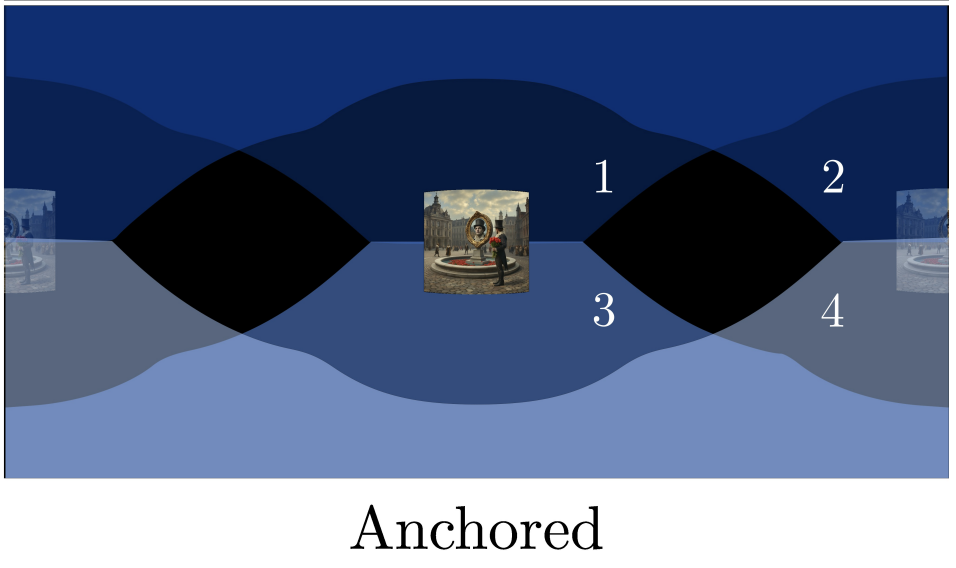

# Training free panorama generation with inpainting via equirectangular mapping

This code implements a traning-free 360 panorama generation pipeline via equirectangular projection and inpainting based on the 2025 Meta paper ["A Recipe for Generating 3D Worlds From a Single Image"](https://arxiv.org/abs/2503.16611). 

## Method Overview

This implementation follows the panorama generation method described in the paper. The approach uses a progressive inpainting strategy with equirectangular projection:

### Panorama Synthesis Process

1. **Equirectangular Projection**: The input perspective image is first embedded into an equirectangular panorama by converting pixel coordinates to spherical coordinates (θ, φ) and then to equirectangular coordinates.

2. **Progressive Inpainting**: The method implements an "Anchored" synthesis strategy where:
   - The input image is duplicated to the backside of the panorama to anchor the synthesis
   - Separate prompts are generated for sky and ground regions using a vision-language model
   - The synthesis begins with sky and ground generation to maximize global context
   - The backside anchor is then removed and remaining regions are generated by rendering and outpainting perspective images
   - Multiple overlapping perspective views are rendered (8 images with 85° FoV for middle region, 4 images each with 120° FoV for top/bottom)
  
   -    
   *Figure: Anchored synthesis strategy showing the input image (center) duplicated to the backside, with numbered regions (1-4) indicating the progressive inpainting order.*

3. **Inpainting Network**: Uses a ControlNet-based inpainting model conditioned on masked input images. The inpainting network is based on [FLUX-Controlnet-Inpainting](https://github.com/alimama-creative/FLUX-Controlnet-Inpainting).

4. **Refinement**: A partial denoising process is applied to improve image quality and ensure smooth transitions between inpainted regions.

For more details, refer to the original paper: ["A Recipe for Generating 3D Worlds From a Single Image"](https://arxiv.org/abs/2503.16611) (ICCV 2025).


## Example Outputs 

Prompt : "a market square in the 1800s" 


Prompt : "a modern japanese garden with a pond and a waterfall" 


## ToDo 
- [x] readme explanation

## Install 

```bash
conda create -n pano_gen python=3.10
conda activate pano_gen
pip install -r requirements.txt
```

## Run the Code 
```bash
python world.py --scene_prompt "a modern japanese garden with a pond and a waterfall" --scene_prompt_sides "a modern japanese garden " --sky_prompt "a clear blue sky"
```

```bash
--scene_prompt : prompt for the middle center image generation 
--scene_prompt_sides : prompt for the sides of the image => should describe general scene layout, but can be less descriptive than scene_prompt
--sky_prompt : prompt for the sky image generation 
--debug : optional mode that stores all inpainting masks, etc.
```

